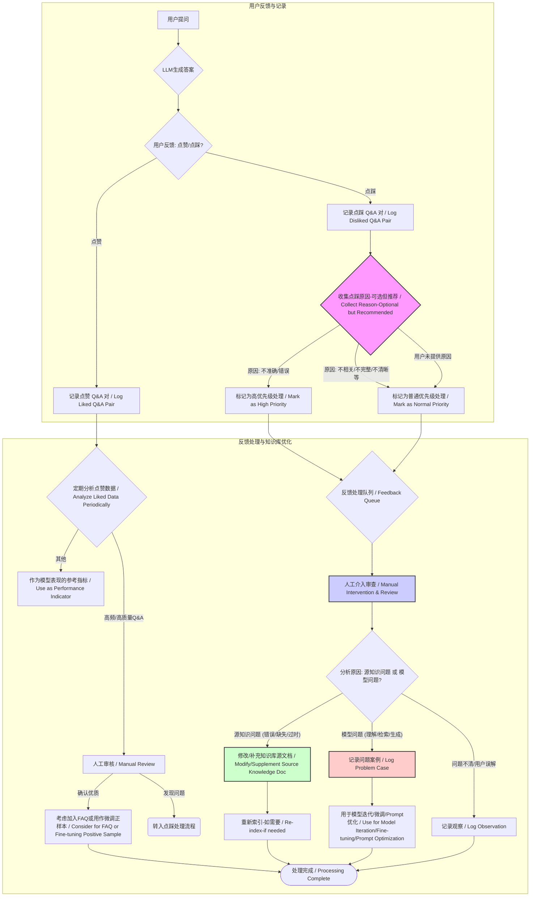

```mermaid
flowchart TD
%%{init: { 'wrap': true, 'wrapPadding': 10, 'fontFamily': 'Arial', 'fontSize': 12 } }%%
    subgraph 用户反馈与记录
        A[用户提问] --> B{LLM生成答案}
        B --> C{用户反馈: 点赞/点踩?}
        C -- 点赞 --> D[记录点赞 Q&A 对 / Log Liked Q&A Pair]
        C -- 点踩 --> E[记录点踩 Q&A 对 / Log Disliked Q&A Pair]
        E --> F{收集点踩原因-可选但推荐 / Collect Reason-Optional but Recommended}
        style F fill:#f9f,stroke:#333,stroke-width:2px
        F -- 原因: 不准确/错误 --> G[标记为高优先级处理 / Mark as High Priority]
        F -- 原因: 不相关/不完整/不清晰等 --> H[标记为普通优先级处理 / Mark as Normal Priority]
        F -- 用户未提供原因 --> H
    end

    subgraph 反馈处理与知识库优化
        D --> I{定期分析点赞数据 / Analyze Liked Data Periodically}
        I -- 高频/高质量Q&A --> J[人工审核 / Manual Review]
        J -- 确认优质 --> K[考虑加入FAQ或用作微调正样本 / Consider for FAQ or Fine-tuning Positive Sample]
        J -- 发现问题 --> L(转入点踩处理流程)
        I -- 其他 --> M[作为模型表现的参考指标 / Use as Performance Indicator]

        G & H --> N{反馈处理队列 / Feedback Queue}
        N --> O[人工介入审查 / Manual Intervention & Review]
        style O fill:#ccf,stroke:#333,stroke-width:2px
        O --> P{分析原因: 源知识问题 或 模型问题?}
        P -- 源知识问题 (错误/缺失/过时) --> Q[修改/补充知识库源文档 / Modify/Supplement Source Knowledge Doc]
        style Q fill:#cfc,stroke:#333,stroke-width:2px
        Q --> R[重新索引-如需要 / Re-index-if needed]
        P -- 模型问题 (理解/检索/生成) --> S[记录问题案例 / Log Problem Case]
        style S fill:#fcc,stroke:#333,stroke-width:2px
        S --> T[用于模型迭代/微调/Prompt优化 / Use for Model Iteration/Fine-tuning/Prompt Optimization]
        P -- 问题不清/用户误解 --> U[记录观察 / Log Observation]

        K & R & T & U --> V([处理完成 / Processing Complete])
    end
```
