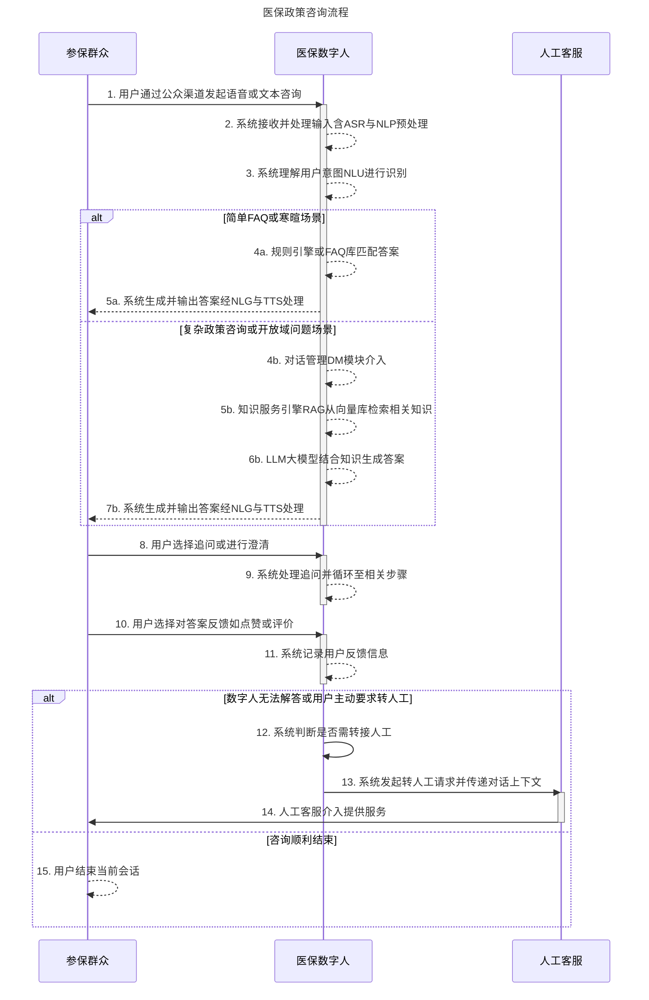

```PlantUML
@startuml
title 医保政策咨询流程 (PlantUML序列图)

actor "参保群众" as User
participant "医保数字人" as DigitalHuman
actor "人工客服" as Agent

User -> DigitalHuman: 1. 用户通过公众渠道发起语音或文本咨询
activate DigitalHuman
DigitalHuman -> DigitalHuman: 2. 系统接收并处理输入含ASR与NLP预处理
DigitalHuman -> DigitalHuman: 3. 系统理解用户意图NLU进行识别

alt 简单FAQ或寒暄场景
    DigitalHuman -> DigitalHuman: 4a. 规则引擎或FAQ库匹配答案
    DigitalHuman --> User: 5a. 系统生成并输出答案经NLG与TTS处理
else 复杂政策咨询或开放域问题场景
    DigitalHuman -> DigitalHuman: 4b. 对话管理DM模块介入
    DigitalHuman -> DigitalHuman: 5b. 知识服务引擎RAG从向量库检索相关知识
    DigitalHuman -> DigitalHuman: 6b. LLM大模型结合知识生成答案
    DigitalHuman --> User: 7b. 系统生成并输出答案经NLG与TTS处理
end
deactivate DigitalHuman

User -> DigitalHuman: 8. 用户选择追问或进行澄清
activate DigitalHuman
DigitalHuman -> DigitalHuman: 9. 系统处理追问并循环至相关步骤
deactivate DigitalHuman

User -> DigitalHuman: 10. 用户选择对答案反馈如点赞或评价
activate DigitalHuman
DigitalHuman -> DigitalHuman: 11. 系统记录用户反馈信息
deactivate DigitalHuman

alt 数字人无法解答或用户主动要求转人工
    DigitalHuman -> DigitalHuman: 12. 系统判断是否需转接人工
    DigitalHuman -> Agent: 13. 系统发起转人工请求并传递对话上下文
    activate Agent
    Agent --> User: 14. 人工客服介入提供服务
    deactivate Agent
else 咨询顺利结束
    User -> User: 15. 用户结束当前会话
end

@enduml
```
