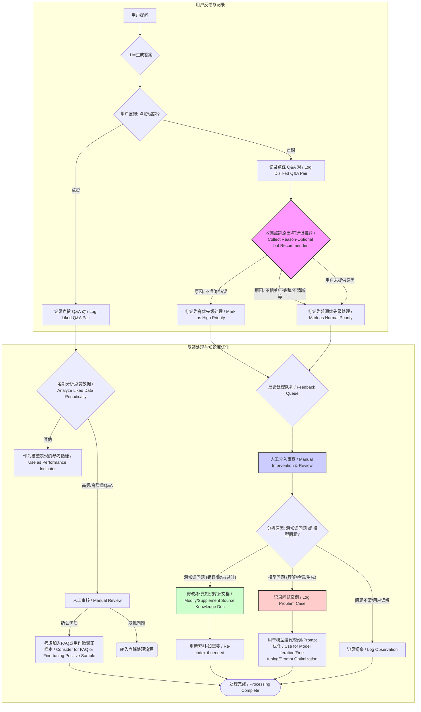

#### 知识库正反馈迭代

```mermaid
flowchart TD
%%{init: { 'wrap': true, 'wrapPadding': 10, 'fontFamily': 'Arial', 'fontSize': 12 } }%%
    subgraph 用户反馈与记录
        A[用户提问] --> B{LLM生成答案}
        B --> C{用户反馈: 点赞/点踩?}
        C -- 点赞 --> D[记录点赞 Q&A 对 / Log Liked Q&A Pair]
        C -- 点踩 --> E[记录点踩 Q&A 对 / Log Disliked Q&A Pair]
        E --> F{收集点踩原因-可选但推荐 / Collect Reason-Optional but Recommended}
        style F fill:#f9f,stroke:#333,stroke-width:2px
        F -- 原因: 不准确/错误 --> G[标记为高优先级处理 / Mark as High Priority]
        F -- 原因: 不相关/不完整/不清晰等 --> H[标记为普通优先级处理 / Mark as Normal Priority]
        F -- 用户未提供原因 --> H
    end

    subgraph 反馈处理与知识库优化
        D --> I{定期分析点赞数据 / Analyze Liked Data Periodically}
        I -- 高频/高质量Q&A --> J[人工审核 / Manual Review]
        J -- 确认优质 --> K[考虑加入FAQ或用作微调正样本 / Consider for FAQ or Fine-tuning Positive Sample]
        J -- 发现问题 --> L(转入点踩处理流程)
        I -- 其他 --> M[作为模型表现的参考指标 / Use as Performance Indicator]

        G & H --> N{反馈处理队列 / Feedback Queue}
        N --> O[人工介入审查 / Manual Intervention & Review]
        style O fill:#ccf,stroke:#333,stroke-width:2px
        O --> P{分析原因: 源知识问题 或 模型问题?}
        P -- 源知识问题 (错误/缺失/过时) --> Q[修改/补充知识库源文档 / Modify/Supplement Source Knowledge Doc]
        style Q fill:#cfc,stroke:#333,stroke-width:2px
        Q --> R[重新索引-如需要 / Re-index-if needed]
        P -- 模型问题 (理解/检索/生成) --> S[记录问题案例 / Log Problem Case]
        style S fill:#fcc,stroke:#333,stroke-width:2px
        S --> T[用于模型迭代/微调/Prompt优化 / Use for Model Iteration/Fine-tuning/Prompt Optimization]
        P -- 问题不清/用户误解 --> U[记录观察 / Log Observation]

        K & R & T & U --> V([处理完成 / Processing Complete])
    end
```
#### 猜你想问、还想问 功能

```mermaid
flowchart TD
    subgraph 数据收集与处理
        A[用户在H5提问] --> B[后台记录提问日志 /问题文本, UserID, 时间戳/]
        B --> C{定期处理日志 /如每天/每小时/ / Process Logs Periodically}
        C --> D[数据清洗与标准化 / Clean & Normalize Questions]
        D --> E{问题频率统计 / Calculate Question Frequency}
        E --> F[识别高频问题 / Identify High-Frequency Questions]
        F --> G{问题聚类/语义相似度分析 /可选但推荐/ / Clustering & Semantic Analysis /Optional/}
        style G fill:#f9f,stroke:#333,stroke-width:2px
        G -- 聚类结果 --> H[生成高频问题/主题列表 / Generate High-Frequency List //Questions/Topics/]
        H --> I[存储于缓存/数据库 / Store in Cache/DB]
    end

    subgraph 功能应用
        J[用户在H5输入框输入] --> K{触发//猜你想问//}
        K --> L[前端发送部分输入到后端 / Frontend Sends Partial Input to Backend]
        L --> M[后端查询高频问题库 /基于前缀或语义匹配/ / Backend Queries High-Freq Store]
        style M fill:#ccf,stroke:#333,stroke-width:2px
        M --> N[返回建议列表 / Return Suggestions]
        N --> O[前端展示建议 / Frontend Displays Suggestions]

        P[LLM返回答案后] --> Q{触发//还想问//}
        Q --> R[后端根据当前问题查询相关问题 / Backend Finds Related Questions for Current Query]
        R -- 使用语义相似度 --> S[查询高频问题库 /基于向量相似度/ / Query High-Freq Store /Vector Similarity/]
        style S fill:#ccf,stroke:#333,stroke-width:2px
        S --> T[返回相关问题列表 / Return Related Questions]
        T --> U[前端展示相关问题 / Frontend Displays Related Questions]
    end
```
