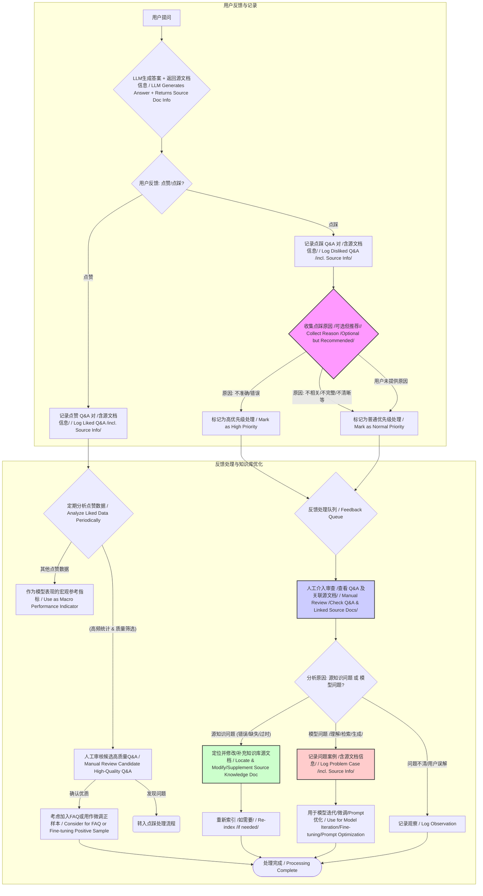
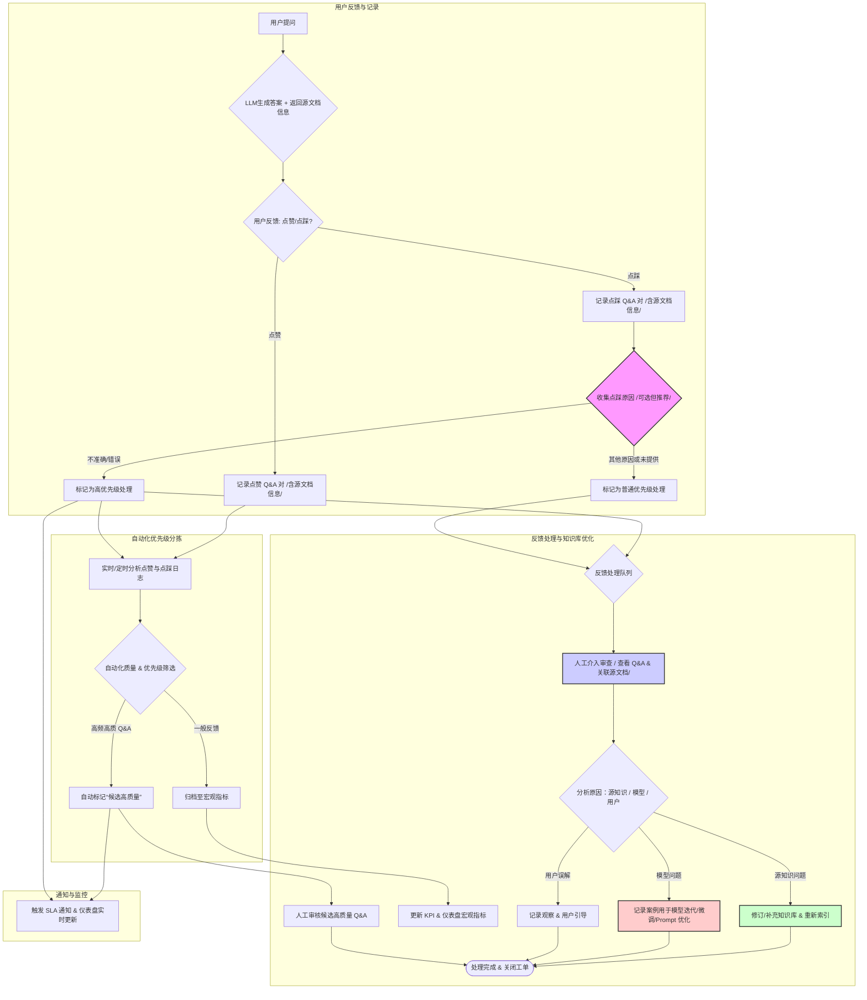
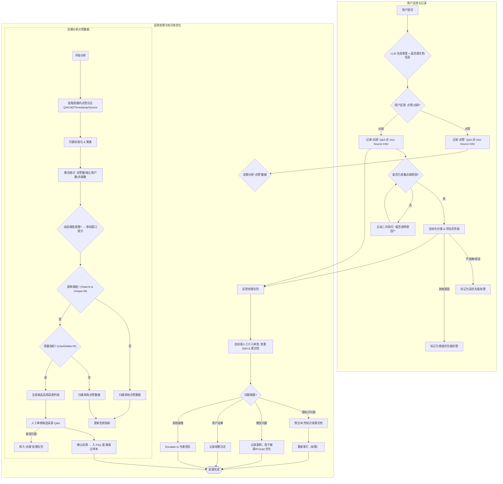

#### 知识库正反馈迭代

```mermaid
flowchart TD
%%{init: { 'wrap': true, 'wrapPadding': 10, 'fontFamily': 'Arial', 'fontSize': 12 } }%%
    subgraph 用户反馈与记录
        A[用户提问] --> B{LLM生成答案}
        B --> C{用户反馈: 点赞/点踩?}
        C -- 点赞 --> D[记录点赞 Q&A 对 / Log Liked Q&A Pair]
        C -- 点踩 --> E[记录点踩 Q&A 对 / Log Disliked Q&A Pair]
        E --> F{收集点踩原因-可选但推荐 / Collect Reason-Optional but Recommended}
        style F fill:#f9f,stroke:#333,stroke-width:2px
        F -- 原因: 不准确/错误 --> G[标记为高优先级处理 / Mark as High Priority]
        F -- 原因: 不相关/不完整/不清晰等 --> H[标记为普通优先级处理 / Mark as Normal Priority]
        F -- 用户未提供原因 --> H
    end

    subgraph 反馈处理与知识库优化
        D --> I{定期分析点赞数据 / Analyze Liked Data Periodically}
        I -- 高频/高质量Q&A --> J[人工审核 / Manual Review]
        J -- 确认优质 --> K[考虑加入FAQ或用作微调正样本 / Consider for FAQ or Fine-tuning Positive Sample]
        J -- 发现问题 --> L(转入点踩处理流程)
        I -- 其他 --> M[作为模型表现的参考指标 / Use as Performance Indicator]

        G & H --> N{反馈处理队列 / Feedback Queue}
        N --> O[人工介入审查 / Manual Intervention & Review]
        style O fill:#ccf,stroke:#333,stroke-width:2px
        O --> P{分析原因: 源知识问题 或 模型问题?}
        P -- 源知识问题 (错误/缺失/过时) --> Q[修改/补充知识库源文档 / Modify/Supplement Source Knowledge Doc]
        style Q fill:#cfc,stroke:#333,stroke-width:2px
        Q --> R[重新索引-如需要 / Re-index-if needed]
        P -- 模型问题 (理解/检索/生成) --> S[记录问题案例 / Log Problem Case]
        style S fill:#fcc,stroke:#333,stroke-width:2px
        S --> T[用于模型迭代/微调/Prompt优化 / Use for Model Iteration/Fine-tuning/Prompt Optimization]
        P -- 问题不清/用户误解 --> U[记录观察 / Log Observation]

        K & R & T & U --> V([处理完成 / Processing Complete])
    end
```

#### V2

```mermaid
flowchart TD
    subgraph 用户反馈与记录
        A[用户提问] --> B{LLM生成答案 + 返回源文档信息 / LLM Generates Answer + Returns Source Doc Info}
        B --> C{用户反馈: 点赞/点踩?}
        C -- 点赞 --> D[记录点赞 Q&A 对 /含源文档信息/ / Log Liked Q&A /incl. Source Info/]
        C -- 点踩 --> E[记录点踩 Q&A 对 /含源文档信息/ / Log Disliked Q&A /incl. Source Info/]
        E --> F{收集点踩原因 /可选但推荐// Collect Reason /Optional but Recommended/}
        style F fill:#f9f,stroke:#333,stroke-width:2px
        F -- 原因: 不准确/错误 --> G[标记为高优先级处理 / Mark as High Priority]
        F -- 原因: 不相关/不完整/不清晰等 --> H[标记为普通优先级处理 / Mark as Normal Priority]
        F -- 用户未提供原因 --> H
    end

    subgraph 反馈处理与知识库优化
        D --> I{定期分析点赞数据 / Analyze Liked Data Periodically}
        I -- (高频统计 & 质量筛选) --> J[人工审核候选高质量Q&A / Manual Review Candidate High-Quality Q&A]
        J -- 确认优质 --> K[考虑加入FAQ或用作微调正样本 / Consider for FAQ or Fine-tuning Positive Sample]
        J -- 发现问题 --> L(转入点踩处理流程)
        I -- 其他点赞数据 --> M[作为模型表现的宏观参考指标 / Use as Macro Performance Indicator]

        G & H --> N{反馈处理队列 / Feedback Queue}
        N --> O[人工介入审查 /查看 Q&A 及关联源文档/ / Manual Review /Check Q&A & Linked Source Docs/]
        style O fill:#ccf,stroke:#333,stroke-width:2px
        O --> P{分析原因: 源知识问题 或 模型问题?}
        P -- 源知识问题 (错误/缺失/过时) --> Q[定位并修改/补充知识库源文档 / Locate & Modify/Supplement Source Knowledge Doc]
        style Q fill:#cfc,stroke:#333,stroke-width:2px
        Q --> R[重新索引 /如需要/ / Re-index /if needed/]
        P -- 模型问题 /理解/检索/生成/ --> S[记录问题案例 /含源文档信息/ / Log Problem Case /incl. Source Info/]
        style S fill:#fcc,stroke:#333,stroke-width:2px
        S --> T[用于模型迭代/微调/Prompt优化 / Use for Model Iteration/Fine-tuning/Prompt Optimization]
        P -- 问题不清/用户误解 --> U[记录观察 / Log Observation]

        K & R & T & U --> V([处理完成 / Processing Complete])
    end
```
#### 猜你想问、还想问 功能

```mermaid
flowchart TD
    subgraph 数据收集与处理
        A[用户在H5提问] --> B[后台记录提问日志 /问题文本, UserID, 时间戳/]
        B --> C{定期处理日志 /如每天/每小时/ / Process Logs Periodically}
        C --> D[数据清洗与标准化 / Clean & Normalize Questions]
        D --> E{问题频率统计 / Calculate Question Frequency}
        E --> F[识别高频问题 / Identify High-Frequency Questions]
        F --> G{问题聚类/语义相似度分析 /可选但推荐/ / Clustering & Semantic Analysis /Optional/}
        style G fill:#f9f,stroke:#333,stroke-width:2px
        G -- 聚类结果 --> H[生成高频问题/主题列表 / Generate High-Frequency List //Questions/Topics/]
        H --> I[存储于缓存/数据库 / Store in Cache/DB]
    end

    subgraph 功能应用
        J[用户在H5输入框输入] --> K{触发//猜你想问//}
        K --> L[前端发送部分输入到后端 / Frontend Sends Partial Input to Backend]
        L --> M[后端查询高频问题库 /基于前缀或语义匹配/ / Backend Queries High-Freq Store]
        style M fill:#ccf,stroke:#333,stroke-width:2px
        M --> N[返回建议列表 / Return Suggestions]
        N --> O[前端展示建议 / Frontend Displays Suggestions]

        P[LLM返回答案后] --> Q{触发//还想问//}
        Q --> R[后端根据当前问题查询相关问题 / Backend Finds Related Questions for Current Query]
        R -- 使用语义相似度 --> S[查询高频问题库 /基于向量相似度/ / Query High-Freq Store /Vector Similarity/]
        style S fill:#ccf,stroke:#333,stroke-width:2px
        S --> T[返回相关问题列表 / Return Related Questions]
        T --> U[前端展示相关问题 / Frontend Displays Related Questions]
    end
```
#### v2-1

```mermaid
flowchart TD
    %% 用户反馈与记录
    subgraph 用户反馈与记录
        A[用户提问] --> B{LLM生成答案 + 返回源文档信息}
        B --> C{用户反馈: 点赞/点踩?}
        C -- 点赞 --> D[记录点赞 Q&A 对 /含源文档信息/]
        C -- 点踩 --> E[记录点踩 Q&A 对 /含源文档信息/]
        E --> F{收集点踩原因 /可选但推荐/}
        style F fill:#f9f,stroke:#333,stroke-width:2px
        F -- 不准确/错误 --> G[标记为高优先级处理]
        F -- 其他原因或未提供 --> H[标记为普通优先级处理]
    end

    %% 自动化优先级分拣
    subgraph 自动化优先级分拣
        D & G --> AA[实时/定时分析点赞与点踩日志]
        AA --> AB{自动化质量 & 优先级筛选}
        AB -- 高频高质 Q&A --> KC[自动标记“候选高质量”]
        AB -- 一般反馈 --> MC[归档至宏观指标]
    end

    %% 反馈处理与知识库优化
    subgraph 反馈处理与知识库优化
        KC --> J[人工审核候选高质量 Q&A]
        MC --> M[更新 KPI & 仪表盘宏观指标]
        G & H --> N{反馈处理队列}
        N --> O[人工介入审查 / 查看 Q&A & 关联源文档/]
        style O fill:#ccf,stroke:#333,stroke-width:2px
        O --> P{分析原因：源知识 / 模型 / 用户}
        P -- 源知识问题 --> Q[修订/补充知识库 & 重新索引]
        style Q fill:#cfc,stroke:#333,stroke-width:2px
        P -- 模型问题 --> S[记录案例用于模型迭代/微调/Prompt 优化]
        style S fill:#fcc,stroke:#333,stroke-width:2px
        P -- 用户误解 --> U[记录观察 & 用户引导]
        Q & S & U & J --> V([处理完成 & 关闭工单])
    end

    %% 通知与监控
    subgraph 通知与监控
        KC & G --> Notify[触发 SLA 通知 & 仪表盘实时更新]
    end
```

#### v3

```mermaid
flowchart TD
  %% ========== 用户反馈与记录 ==========
  subgraph 用户反馈与记录
    A[用户提问] --> B{LLM 生成答案 + 返回源文档信息}
    B --> C{用户反馈: 点赞/点踩?}
    C -- 点赞 --> D[记录“点赞” Q&A 对 /incl. Source Info/]
    C -- 点踩 --> E[记录“点踩” Q&A 对 /incl. Source Info/]
    E --> F{是否已收集点踩原因?}
    F -- 是 --> F1[自动化分类 & 评估优先级]
    F -- 否 --> F2[主动二次询问: “能否说明原因?”]
    F2 --> F
    F1 -- 不准确/错误 --> G[标记为高优先级处理]
    F1 -- 其他原因 ---> H[标记为普通优先级处理]
  end

  %% ========== 反馈处理与知识库优化 ==========
  subgraph 反馈处理与知识库优化
    D --> I{定期分析“点赞”数据}
    E & F1 --> N[反馈处理队列]
  
    %% 点赞分析子流程
    subgraph 定期分析点赞数据
      I_Start(开始分析) --> I_Input["提取周期内点赞日志\nQ/A/UID/Timestamp/Source"]
      I_Input --> I_Cluster[问题标准化 & 聚类]
      I_Cluster --> I_Agg["聚合统计: 总赞数/独立用户数/总踩数"]
      I_Agg --> I_Adapt{"动态阈值调整? → 滑动窗口统计"}
      I_Adapt --> I_FilterFreq{"频率阈值? (Total>N & Unique>M)"}
      I_FilterFreq -- 否 --> I_Other1[归类其他点赞数据]
      I_FilterFreq -- 是 --> I_FilterQual{"质量指标? (Like/Dislike>R)"}
      I_FilterQual -- 否 --> I_Other2[归类其他点赞数据]
      I_FilterQual -- 是 --> I_HighQ[生成候选高频高质列表]
      I_HighQ --> J[人工审核候选高质 Q&A]
      I_Other1 & I_Other2 --> M[更新宏观指标]
      J --> K[确认优质 → 入 FAQ 或 微调正样本]
      J -- 发现问题 --> L[转入“点踩”处理队列]
    end

    %% 点踩处理子流程
    N --> O[自动或人工介入审查: 查看 Q&A & 源文档]
    O --> P{问题根源?}
    P -- 源知识问题 --> Q[修正/补充知识库源文档]
    Q --> R[重新索引（如需）]
    P -- 模型问题   --> S[记录案例，用于微调/Prompt 优化]
    P -- 用户误解   --> U[记录观察日志]
    P -- 其他疑难   --> T[Escalate to 专家团队]
    R & K & S & U & T --> V([处理完成])
  end
```

#### v4

```mermaid
flowchart TD
    subgraph 高频问答挖掘模块
        HF1[定期聚合所有 Q&A 数据] --> HF2[进行问题标准化/语义聚类]
        HF2 --> HF3[计算问题热度指标 -点击量, 停留, 点赞数等]
        HF3 --> HF4[生成“高频问答簇”列表]
        HF4 --> HF5[每簇选Top-K作为代表问题]
    end

    subgraph 猜你想问-输入时推荐
        U_Input[用户输入问题实时更新] --> R1[实时向量化 /Embeddings]
        R1 --> R2[与高频问答簇计算语义相似度]
        R2 --> R3[返回前K条猜你想问]
    end

    subgraph 还想问-回答后推荐
        R4[获取当前问答所属问答簇] --> R5[查找该簇内其他高热度Q&A]
        R5 --> R6[过滤重复/已答，推荐还想问问题]
    end

```
